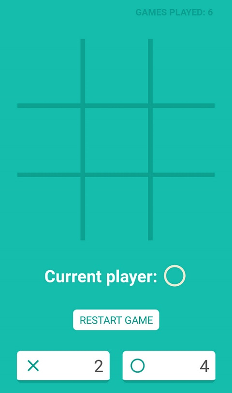

# Tic Tac Toe

This is an experimental project made with [React Native](https://facebook.github.io/react-native/) and the new way of writing components: [React Hooks](https://reactjs.org/docs/hooks-intro.html).

_Hooks are a new addition in React 16.8. They let you use state and other React features without writing a class._

The project is a basic tic tac toe game with the following features: game counter (kept even if you close the app) and session games score

It's layout is based on [google's own tic tac toe game](https://www.google.com/search?q=tic+tac+toe)

Here is a screenshot preview of what it looks like:

